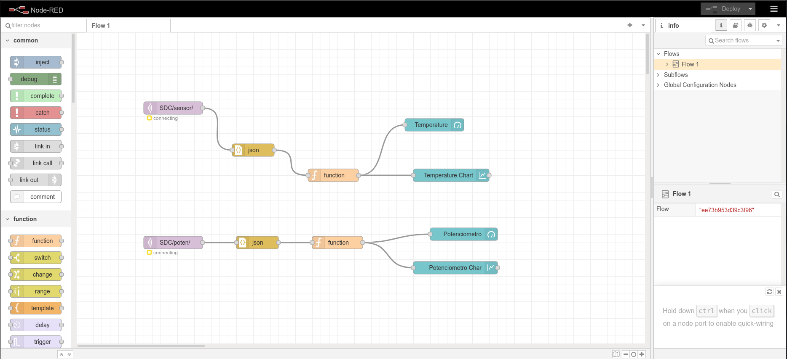
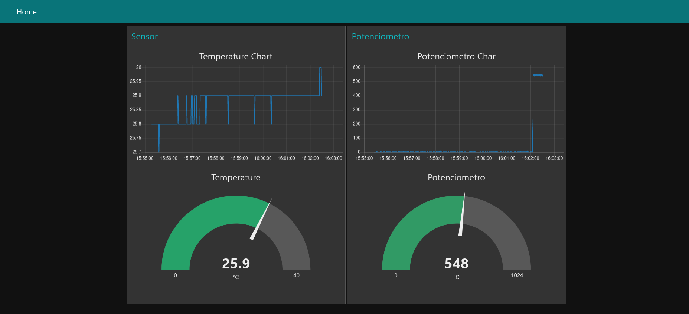

# MQTT - NodeRED - Arduino

Este direcotrio contiene un ejemplo de funcionamiento de MQTT (pub/sub). El publicador se trata de un Arduino MKR WiFi 1010 que tiene conectado un sensor de temperatura (DH11) y un potenciómetro. El broker será mosquitto que correra en nuestro PC junto con subscriptores para testear el comportamiento. Nuestro Arduino MKR publicará los siguientes mensajes (JSON) en diferentes topics

### Humedad y Temperature

* Topic: SDC/sensor/
* Datos:
```json
{ "Humedad" : 27.00, "Temperatura" : 25.50}
```

### Potenciometro

* Topic: SDC/poten/
* Datos:
```json
{ "poten" : 411 }
```

Carga el sketch de arduino que encontrarás en este repositorio en tu Arduino MKR WiFi 1010.

## Mosquitto

* Arranca mosquitto en tu máquina

```shell
/usr/sbin/mosquitto  -c mosquitto.conf
```

El archivo de configuración de mosquitto.conf:

```shell
$ cat mosquitto.conf
listener 1883 0.0.0.0
allow_anonymous true

```

* Arranca los subscriptores en los diferentes topics

```shell
mosquitto_sub -h 0.0.0.0 -p 1883 -t SDC/sensor/

mosquitto_sub -h 0.0.0.0 -p 1883 -t SDC/poten/

```

## NodeRED

Puedes instalar nodeRED en tu sistema siguiente las indicaciones en la página web [https://nodered.org/docs/getting-started/local](https://nodered.org/docs/getting-started/local)

Una vez instalado, arranca nodeRED (node-red-start) y carga el flujo que encontrarás **flows.json**. Comprueba que está todo correcto y despliega el flujo dentro de NodeRED.



