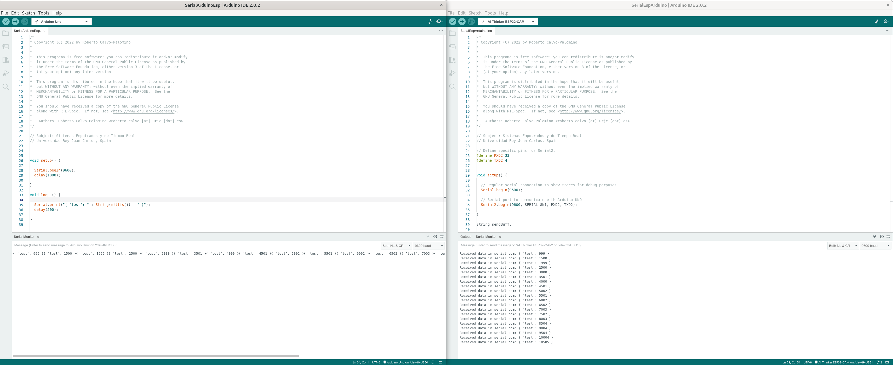

# SerialComArduinoESP32

En este directorio encontrarás código de ejemplo para realizar una comunicación serie entre Arduino UNO y ESP32 con la configuración de [Elegoo Smart Robot CarKit 4.0](https://www.elegoo.com/blogs/arduino-projects/elegoo-smart-robot-car-kit-v4-0-tutorial)

Recuerda que puedes recordar tanto el ESP como el Arduino UNO a tu ordenador, cada uno con un cable, y ver las trazas de los 2 dispositivos a la vez abriendo dos instancias de arduino-ide.

